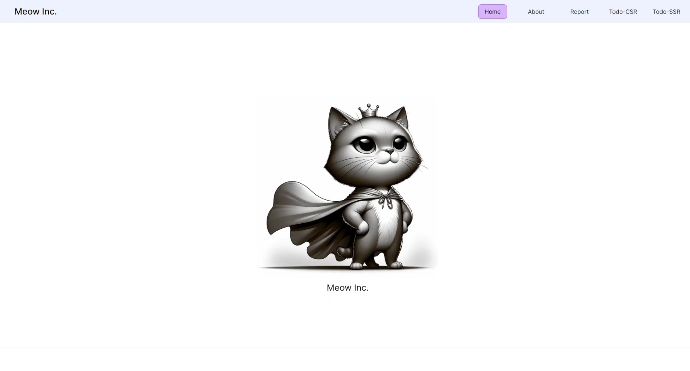
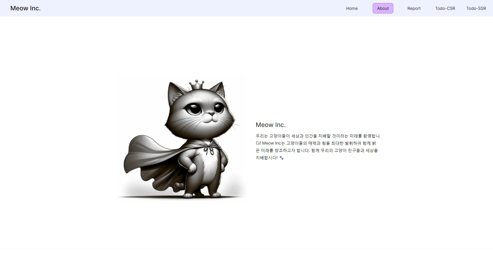
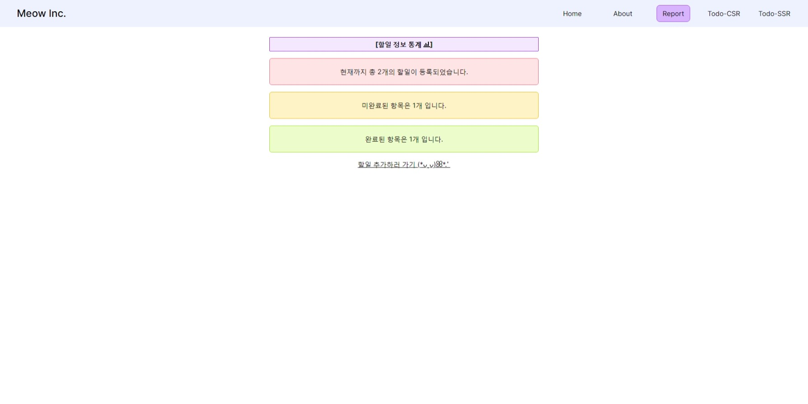
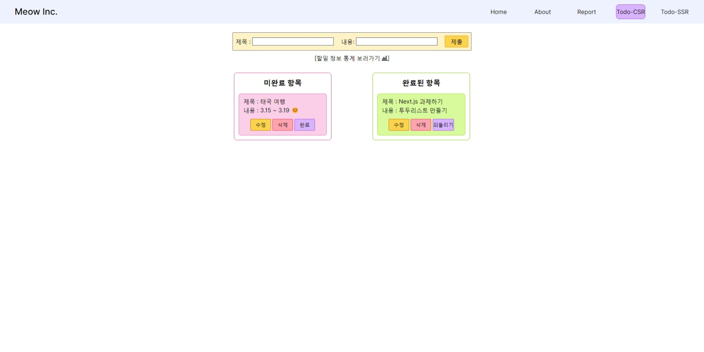
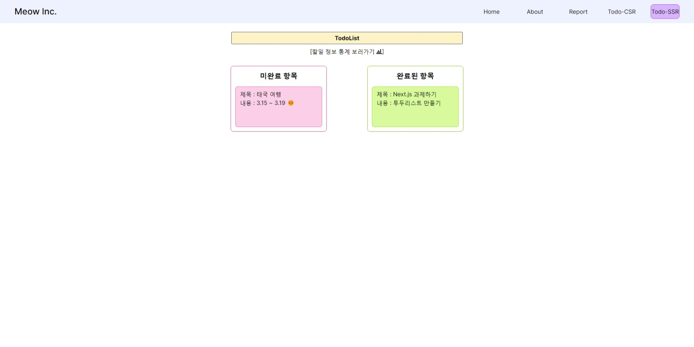

# 👽 NextTasker

 

**Next.js**를 사용한 투두리스트 프로젝트를 통해 Next의
SSG, ISR, CSR, SSR 렌더링 방식 이해하기

 

### 🔽 **개발 환경**

- **Environment :** VSCode, github
- **Development :** Next.js, React, Typescript
- **Library :** tanstack-query, tailwind, react-icons, json-server

 

### 🔽 화면 구성 및 기능

### 1. Home 페이지, About 페이지

|                        Home 페이지                         |                       About 페이지                        |
| :--------------------------------------------------------: | :-------------------------------------------------------: |
|  |  |

- Home페이지와 About페이지는 SSG(Static Site Generation) 렌더링 방식을 사용하는 페이지로 회사의 정보를 불러와 보여줍니다.

 

### 2. Report 페이지

|                       Report 페이지                        |
| :--------------------------------------------------------: |
|  |

- Report 페이지는 ISR(Incremental Static Regeneration) 렌더링 방식을 사용하는 페이지로 10초의 revalidate 시간을 가지고 정보를 불러와 보여줍니다.
- 현재 등록된 할일 갯수 및 완료된 할일 갯수, 미완료된 할일 갯수를 보여줍니다.

 

### 3. Todo-CSR 페이지

|                       Report 페이지                        |
| :--------------------------------------------------------: |
|  |

- Todo-CSR 페이지는 CSR(Client-Side Rendering)방식을 사용하는 페이지입니다.
- 할일 추가 및 수정, 삭제가 가능합니다.
- 완료 또는 되돌리기 버튼을 눌러 완료 상태를 토글할 수 있습니다.

 

### 4. Todo-SSR 페이지

|                       Report 페이지                        |
| :--------------------------------------------------------: |
|  |

- Todo-SSR 페이지는 SSR(Server-Side Rendering) 방식을 사용하는 페이지입니다.
- 데이터 조회를 제외한 다른 상호작용을 할 수 없습니다.

 
